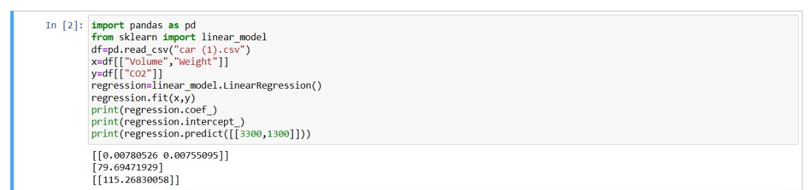

# Implementation of Multivariate Linear Regression
## Aim
To write a python program to implement multivariate linear regression and predict the output.
## Equipment’s required:
1.	Hardware – PCs
2.	Anaconda – Python 3.7 Installation / Moodle-Code Runner
## Algorithm:
### Step-1
Import Libraries and Load Data

### Step-2
Select Features and Target Variable

### Step-3
Create and Train the Model

### Step-4
Display Model Coefficients and Intercept

### Step-5
Make Predictions Using the Trained Model

## Program:
```
import pandas as pd
from sklearn import linear_model
df=pd.read_csv("car (1).csv")
x=df[["Volume","Weight"]]
y=df[["CO2"]]
regression=linear_model.LinearRegression()
regression.fit(x,y)
print(regression.coef_)
print(regression.intercept_)
print(regression.predict([[3300,1300]]))

```
## Output:


## Result
Thus the multivariate linear regression is implemented and predicted the output using python program.